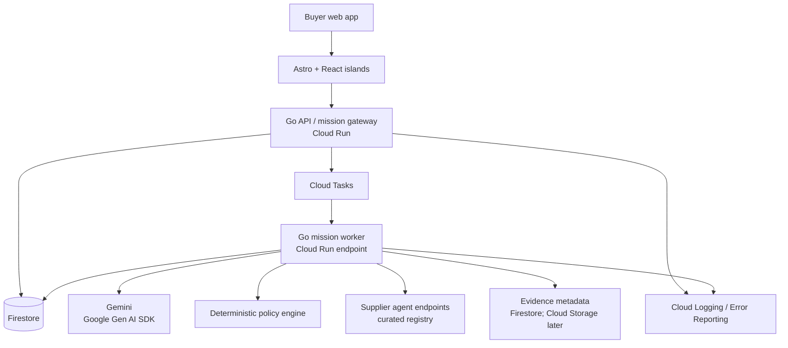

# Architecture

## Architecture goals

Yaler should demonstrate a real autonomous workflow while remaining small enough to understand, test, and reproduce.

The architecture optimizes for:

- Durable asynchronous missions
- Explicit policy enforcement
- Clear separation between model and application logic
- Fast greenfield implementation
- Google Cloud deployment
- Low idle cost
- A clean path from hackathon to pilot
- Judges can clone and run locally or against cloud services

## System diagram



## Frontend

### Astro

Astro is used for:

- Public landing pages
- Public supplier agent cards
- Shareable proof receipts
- Documentation and onboarding
- Fast initial page loads

### React islands

Interactive islands are used only where needed:

- `MissionForm` — speak or type what’s broken; creates a live mission
- `SpeakNote` — Vapi (Web Speech fallback) on rehearsal and the live form
- `HearReceipt` — ElevenLabs reads the paper (`POST /api/tts`)
- `SavedMandateCard` — shows rules saved after a rehearsal
- `MandateEditor` — check budget and area, then start looking (no page reload)
- `OfferComparison` — ranked quotes; Exa “found this morning” cards (not bookable); fail-closed register line
- `MissionTimeline` — goal, plain-English status, next action; traces are opt-in
- `EvidenceForm` — engineer photo and note (`/evidence/[id]`)
- `RehearsalPlaythrough` — labelled N1 fridge rehearsal; speak in, hear the receipt; no live booking

Shared operator copy lives in `web/src/lib/copy.ts`. Rehearsal fixtures live in `web/src/lib/rehearsal.ts`. The visual system is paper/ink/mandate (`docs/BRAND.md`), not a dark agent console.

Astro should not become a React application hidden inside a framework. Keep public pages server-rendered and isolate stateful interactions. Route changes use Astro `navigate()` so view transitions run; do not `window.location.reload()` after mandate confirm.

## Backend

### Go mission gateway

Responsibilities:

- HTTP API
- Authentication and authorization boundary
- Mission creation
- Mandate validation
- Event writes
- Cloud Tasks enqueueing
- Supplier endpoint communication
- Idempotency keys
- API error handling

### Go mission worker

Responsibilities:

- Load mission state
- Select the next deterministic step
- Call Gemini where interpretation is needed
- Execute validated tools
- Write state and events
- Schedule the next task
- Retry transient failures
- Escalate policy or safety failures

The gateway and worker may initially be one Go service with separate routes. Split deployments only if operationally useful.

### Find and credentials (not dispatch)

- `GET /api/discovery` — Exa nearby names + URLs. Labelled “found this morning.” Never written into the bookable supplier store.
- `GET /api/credentials` — Apify reads Companies House. Returns `listed` or **fails closed** to `not_checked`.
- `POST /api/tts` — ElevenLabs reads the receipt. Frontend falls back to Web Speech if the key is missing.

## Gemini

Use the Google Gen AI Go SDK:

```text
google.golang.org/genai
```

Gemini is responsible for:

- Parsing natural-language goals
- Extracting structured constraints
- Matching mission requirements to provider capabilities
- Comparing offers
- Drafting counteroffers
- Extracting evidence from text and images
- Recommending escalation
- Generating human-readable explanations

Gemini is not allowed to directly mutate mission state. It proposes a typed action; Go validates and executes it.

## Deterministic policy engine

The policy engine checks:

- Budget ceiling
- Deadline
- Geographic radius
- Allowed supplier categories
- Required credentials or evidence
- Autonomy mode
- Approval thresholds
- Expiration time
- Prohibited work categories

Example:

```text
If proposed price > mandate budget:
    reject automatic commitment
    create exception

If task category is regulated or credential evidence is missing:
    block autonomous dispatch
    request human verification
```

## Firestore data model

```text
agents/{agentId}
  principalType
  displayName
  capabilities
  serviceArea
  availability
  evidence
  status
  verified      # true only after human register + capability check
  contact       # phone/WhatsApp for concierge outreach
  source        # SEED | CONCIERGE | PORTAL
  onboardedAt

missions/{missionId}
  goal
  status
  mandate
  buyerId
  selectedSupplierId
  createdAt
  updatedAt
  version

missions/{missionId}/offers/{offerId}
  supplierAgentId
  calloutId     # traceability: offer must map to a callout
  price
  availability
  terms
  evidence
  status
  simulated     # true for synthetic-roster quotes (clearly labelled)

missions/{missionId}/callouts/{calloutId}
  supplierId
  status        # SENT | OFFERED | DECLINED | EXPIRED
  message       # deterministic scoped ask drafted for the concierge
  sentAt
  expiresAt
  respondedAt
  simulated     # true for synthetic-roster callouts

missions/{missionId}/milestones/{milestoneId}
  description
  dueAt
  status
  evidenceIds

missions/{missionId}/events/{eventId}
  type
  actor
  payload
  policyResult
  createdAt
  idempotencyKey

missions/{missionId}/feedback/{feedbackId}
  supplierId
  rating        # 1..5, from the buyer on mission completion
  comment
  createdAt

proofReceipts/{receiptId}
  missionId
  summary
  redactedEvidence
  shareToken
  createdAt
```

Firestore is preferred because mission state and event timelines are document-oriented and quick to evolve. Move to Cloud SQL only if search, reporting, or relational complexity becomes a demonstrated bottleneck.

## Supply side (concierge wedge)

The supply side runs as a human-in-the-loop concierge wedge (see
`docs/SUPPLY-SIDE.md` for the full runbook):

- The worker never fabricates offers. On SOURCING it creates one `Callout`
  per matching ACTIVE supplier, each with a deterministic kitchen-English
  message (scope, budget, deadline, district).
- **Verified** suppliers (`agent.verified = true`, set only after a human
  register lookup + capability/capacity check) take real callouts: the
  mission waits in SOURCING until the concierge enters the supplier's quote
  via `POST /api/callouts/{id}/offer` (or records a decline).
- **Unverified** roster suppliers (the synthetic seed) get auto-generated
  simulated quotes labelled `simulated: true` with terms
  "Simulated quote - synthetic roster, not a real offer", so the demo stays
  runnable with an empty real roster.
- Concierge endpoints (`/api/callouts/{id}/offer`, `/api/suppliers/onboard`)
  honour `OPS_TOKEN` (header `X-Ops-Token`) when set; open in local demo.
- Callouts expire lazily after 4h (checked on list/answer). An in-process
  sweeper (`SweepStalledSourcing`, 15s ticker in `cmd/server`) expires
  past-due callouts and escalates any SOURCING mission whose callouts are
  all DECLINED/EXPIRED with no offers (FR-6). A Cloud Tasks cron is the
  production shape for the sweeper once the durable queue lands.

Worker durability is still pending (see below) — the concierge loop is
built, but the fire-and-forget goroutine remains the known weakness.

## Asynchronous execution

Use Cloud Tasks for mission work:

```text
mission.created
→ source.suppliers
→ collect.offers
→ evaluate.offers
→ send.counteroffer
→ check.milestone
→ verify.evidence
→ complete.or.escalate
```

Every task must include:

- Mission ID
- Step ID
- Expected mission version
- Idempotency key
- Attempt count
- Deadline

A task must be safe to retry.

Pub/Sub is not required for the MVP. Add it only when one event needs to fan out to multiple independent consumers.

## Evidence

For the Kiro kernel, store evidence as Firestore metadata: supplier text, source labels, and an optional labelled fixture reference. Cloud Storage for photos or documents is the Horizon 2 path; add it when real uploads are required.

Do not expose private supplier or buyer information in public proof receipts. Public receipts should be explicitly redacted and opt-in.

## Authentication and secrets

- The Kiro demo has no login. Use a single implicit demo buyer so judges can run the flow without credentials.
- Firebase Authentication or a minimal email-link flow is for the Horizon 2 pilot, not the submission.
- Use Cloud Run service identity for Google Cloud access when deployed.
- Store API keys and signing secrets in Secret Manager in production, and in `.env` locally. Never commit secrets.
- Do not place service-account JSON keys in the repository or container.
- Separate buyer, supplier, and operator permissions when auth is added.

## Observability

Every mission event should include:

- Mission ID
- Agent ID
- Principal ID
- Tool or operation
- Input reference
- Policy decision
- Outcome
- Latency
- Error classification

Cloud Logging should make it possible to show a judge one mission moving from request to completion.

## Security boundaries

- The model cannot bypass mandate checks.
- Supplier-provided content is untrusted input.
- Tool arguments are validated with typed schemas.
- All state transitions use optimistic version checks.
- Public receipts contain redacted evidence only.
- Regulated or unsafe work always escalates.
- Human stop controls can cancel a mission and revoke delegation.

## Deployment shape

```text
yaler-web      Astro application on Cloud Run or static hosting
yaler-agent    Go API and worker on Cloud Run
firestore      durable state
cloud-tasks    asynchronous mission execution
cloud-storage  optional later; not required for Kiro
secret-manager credentials
cloud-logging  runtime evidence
```

Production is already split: Astro on Netlify, Go on Cloud Run. See [DEPLOY.md](DEPLOY.md). `make deploy-backend` is the only backend ship path. Frontend is push-to-`main`.

## Local development

For judges and contributors to run locally:

- Go service runs with Firestore emulator (or a test GCP project).
- Astro dev server proxies API calls to the Go service.
- Cloud Tasks are a labelled direct HTTP call to the worker when `CLOUD_TASKS_EMULATOR=true`. Production enqueues real Cloud Tasks. Do not present the local path as a queue.
- Gemini API calls use a Google AI Studio key (no GCP project required for the model).
- `.env.example` documents all required configuration, including costs and rate-limit notes for judges.
- A `Makefile` or equivalent should provide `make dev`, `make test`, and `make build` once Task 1 exists. Do not document those targets as working before they do.
