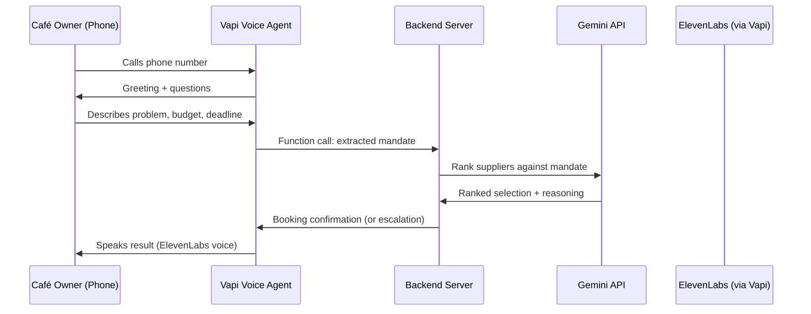
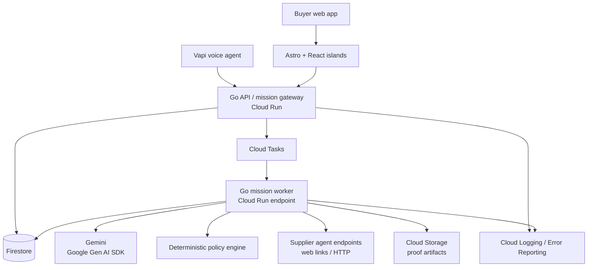

# Architecture

## Architecture across horizons

Yaler's architecture is layered. V1 is minimal — a voice loop with no infrastructure. V2 adds durable state, async execution, and a web frontend on Google Cloud. Each layer extends rather than replaces the previous.

---

## V1 architecture — Voice loop

### System diagram



### Components

| Component | Technology | Responsibility |
|-----------|-----------|----------------|
| Voice agent | Vapi | Conversational intake, mandate extraction via function calling |
| Backend | TypeScript (single file or minimal server) | Receives structured mandate, calls Gemini, returns result |
| LLM | Gemini (Google AI Studio API) | Ranks suppliers, explains selection, detects failures |
| Voice output | ElevenLabs (configured as Vapi voice) | Natural speech for confirmations and escalations |

### V1 data flow

```text
Phone call
  → Vapi extracts: { goal, budget, deadline, location, urgency }
  → Backend receives structured mandate
  → Gemini prompt: "Given this mandate and these 3 suppliers, rank them and select the best fit. If none fit, explain why."
  → Response: { selectedSupplier, reasoning, escalation? }
  → Vapi speaks: confirmation or escalation message
```

### V1 Gemini usage

Single prompt pattern — supplier ranking:

```text
Input:
- Mandate (goal, budget, deadline, location)
- 3 supplier profiles (capabilities, pricing, availability, service area, reliability)

Output (structured JSON):
- ranked list with scores
- selected supplier or null
- reasoning string
- escalation flag + reason if no fit
```

Use Gemini's structured output / JSON mode to get reliable parsing.

### V1 deployment

- Local development or a single serverless function (Vercel/Cloudflare Worker/Cloud Function).
- No database. Supplier data is a JSON constant in the code.
- Vapi handles telephony, conversation state, and voice synthesis.
- Single environment variable for Gemini API key.

### V1 → V2 migration path

| V1 component | Becomes in V2 |
|--------------|---------------|
| Hardcoded supplier JSON | Firestore `agents/` collection |
| Single Gemini ranking prompt | One of several tool-call patterns in the mission worker |
| Vapi function call | One mission creation entry point (alongside web UI) |
| Backend server response | First event in the mission event timeline |
| ElevenLabs voice output | One notification channel (voice, alongside web timeline) |

---

## V2 architecture — Full mission loop

### Architecture goals

- Durable asynchronous missions
- Explicit policy enforcement
- Clear separation between model and application logic
- Fast greenfield implementation
- Google Cloud evidence for the hackathon
- Low idle cost
- Clean path from demo to pilot

### System diagram



### Frontend

#### Astro

- Public landing pages
- Public supplier agent cards
- Shareable proof receipts
- Documentation and onboarding
- Fast initial page loads

#### React islands

Interactive islands only where needed:

- `MissionForm`
- `MandateEditor`
- `OfferComparison`
- `MissionTimeline`
- `ExceptionPanel`
- `EvidenceUpload`

Keep public pages server-rendered. Isolate stateful interactions.

### Backend

#### Go mission gateway

- HTTP API
- Authentication and authorization boundary
- Mission creation (from web UI or Vapi webhook)
- Mandate validation
- Event writes
- Cloud Tasks enqueueing
- Supplier endpoint communication
- Idempotency keys
- API error handling

#### Go mission worker

- Load mission state
- Select next deterministic step
- Call Gemini where interpretation is needed
- Execute validated tools
- Write state and events
- Schedule next task
- Retry transient failures
- Escalate policy or safety failures

Gateway and worker may initially be one Go service with separate routes. Split only if operationally useful.

### Gemini (V2)

Use the Google Gen AI Go SDK:

```text
google.golang.org/genai
```

Gemini handles:

- Parsing natural-language goals
- Extracting structured constraints
- Matching mission requirements to provider capabilities
- Comparing offers
- Drafting counteroffers
- Extracting evidence from text and images
- Recommending escalation
- Generating human-readable explanations

Gemini cannot directly mutate mission state. It proposes a typed action; Go validates and executes.

### Deterministic policy engine

Checks:

- Budget ceiling
- Deadline
- Geographic radius
- Allowed supplier categories
- Required credentials or evidence
- Autonomy mode
- Approval thresholds
- Expiration time
- Prohibited work categories

### Firestore data model

```text
agents/{agentId}
  principalType
  displayName
  capabilities
  serviceArea
  availability
  evidence
  status

missions/{missionId}
  goal
  status
  mandate
  buyerId
  selectedSupplierId
  createdAt
  updatedAt
  version

missions/{missionId}/offers/{offerId}
  supplierAgentId
  price
  availability
  terms
  evidence
  status

missions/{missionId}/milestones/{milestoneId}
  description
  dueAt
  status
  evidenceIds

missions/{missionId}/events/{eventId}
  type
  actor
  payload
  policyResult
  createdAt
  idempotencyKey

proofReceipts/{receiptId}
  missionId
  summary
  redactedEvidence
  shareToken
  createdAt
```

### Asynchronous execution

Cloud Tasks for mission work:

```text
mission.created
→ source.suppliers
→ collect.offers
→ evaluate.offers
→ send.counteroffer
→ check.milestone
→ verify.evidence
→ complete.or.escalate
```

Every task includes: mission ID, step ID, expected version, idempotency key, attempt count, deadline.

### Evidence

Cloud Storage for photos/documents. Firestore stores metadata and access references. Public receipts are redacted and opt-in.

### Authentication and secrets

- Firebase Authentication or minimal email-link flow for pilot.
- Cloud Run service identity for GCP access.
- API keys in Secret Manager.
- No service-account JSON in repo or container.
- Separate buyer, supplier, and operator permissions.

### Observability

Every mission event includes: mission ID, agent ID, principal ID, tool/operation, input reference, policy decision, outcome, latency, error classification.

### Security boundaries

- Model cannot bypass mandate checks.
- Supplier content is untrusted input.
- Tool arguments validated with typed schemas.
- State transitions use optimistic version checks.
- Public receipts contain redacted evidence only.
- Regulated/unsafe work always escalates.
- Human stop controls can cancel and revoke delegation.

### Deployment shape

```text
yaler-web      Astro on Cloud Run or static hosting
yaler-agent    Go API and worker on Cloud Run
firestore      durable state
cloud-tasks    async mission execution
cloud-storage  evidence artifacts
secret-manager credentials
cloud-logging  runtime evidence
```

Combining web and API into one Cloud Run service is acceptable initially. Separate once the mission loop is stable.
